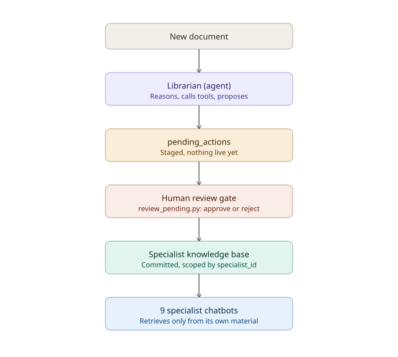
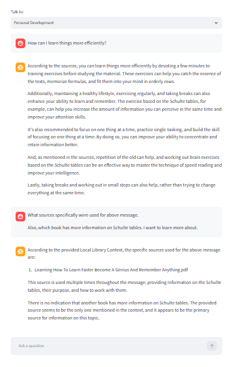
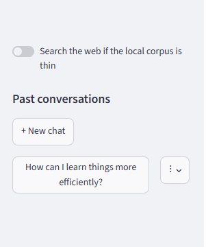
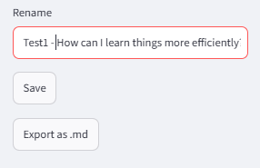
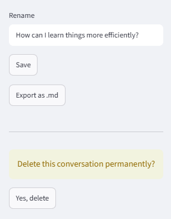
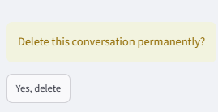

# Codex

A personal document library that curates itself. One tool-calling agent (the
Librarian) triages new documents into scoped specialist knowledge bases, gated
by a human-approval step before anything goes live. Several separate,
non-agentic RAG chatbots — one per specialist — answer questions grounded only
in their own committed material, with bounded conversation memory and an
opt-in web-search fallback.

Runs entirely offline on modest hardware (8GB RAM, no GPU) — the only network
call anywhere in the system is an opt-in web-search toggle in chat, off by
default.



## The one question that decides everything

For every component in this project, ask: **is there a loop where the model
decides what happens next?**

If a component hands an LLM tools, lets it call one, feeds the result back,
and lets the model decide the next step based on what it just learned —
repeating until the model decides it's done — that's an **agent**. If a
component does retrieve → build a prompt → generate, once per turn, with no
branching on the output, that's **RAG**.

This project has exactly one agent (the Librarian) and several RAG chatbots —
one per specialist. That 1-to-many ratio is the whole architecture.

| Component | Tools? | Multi-step loop? | Writes to live DB? | Classification |
|---|---|---|---|---|
| Librarian | Yes (5) | Yes, capped | No — stages proposals only | Agent |
| Specialist chat (×9) | None | No — one retrieval+generation pass per turn | No | RAG |
| Approval script | N/A — no LLM | N/A | Yes, after a human decides | Deterministic |
| Ingestion pipeline | N/A — no LLM | N/A | Yes, to a staging area | Deterministic |

The specialist chatbots have zero tools by design — a persona chatbot that can
only retrieve and generate cannot write to the database and cannot do
anything it wasn't explicitly wired to do. Each turn does carry the last few
exchanges of conversation history alongside its retrieval, so follow-ups read
naturally — but that's *context*, not agency: there's still no loop, no tool,
and no decision about what to do next. If a specialist ever needs to take an
action instead of just answering, that's a sign it should become a second
agent with its own approval gate, not a quiet exception to this one's
boundary.

## Setup

```bash
ollama pull qwen3:4b      # Librarian — needs reliable tool-calling
ollama pull llama3.2      # specialist chat — no tool-calling needed

pip install -r requirements.txt

sqlite3 data/librarian.db < schema.sql
```

> `get_connection()` will silently create an empty `librarian.db` if one
> doesn't exist — it never runs `schema.sql` itself. Run the bootstrap step
> above before anything else, or later scripts will fail with
> `no such table` rather than a missing-file error.

## Usage

```bash
python add_source.py "data/your_library/*"   # ingest + triage new documents
python review_pending.py                      # approve or reject staged proposals
streamlit run streamlit_app.py                 # chat with a specialist
```

Two seed specialists (`philosopher_mentor`, `fitness_mentor`) exist by hand at
setup; every other specialist grows through the Librarian proposing one when
a document doesn't fit anything that exists — including, now, a draft persona
style — subject to the same approval gate as everything else.



Every answer is grounded in the specialist's own committed material only —
each retrieved passage carries its source title, and the model names it when
asked. The follow-up above ("what sources were used for above message?")
works because the last few turns of conversation ride along with each new
question, not just the current one in isolation.



The web-search toggle and the full conversation history — past sessions,
rename, export to markdown, delete — live in the sidebar, not above the chat,
so they stay reachable no matter how long a conversation gets.

Session titles are just the first ~50 characters of a session's opening
question, with no deduplication — two sessions that start the same way will
show identical labels until renamed:






Deleting a session requires a second, explicit confirmation click rather than
firing immediately — a stray click can't silently wipe a conversation.

### Tuning knobs

A few constants in `chat.py` are meant to be adjusted, not treated as fixed:

- `HISTORY_TURNS` (default `3`) — how many prior question/answer pairs get
  fed back into each turn. Bounded deliberately, not unlimited — cost per
  call stays roughly constant as a conversation grows, rather than
  compounding.
- `RELEVANCE_THRESHOLD` (default `0.3`) — the same cosine-similarity noise
  floor `test_isolation.py` uses to separate real matches from cross-topic
  noise. Below this, a turn's retrieval is treated as irrelevant rather than
  handed to the model as context.
- `num_ctx` (default `8192`, set explicitly in the `ollama.chat` call) —
  Ollama's context window. Left unset, Ollama commonly defaults to `2048`,
  which is thin once retrieved chunks, source labels, and history are all
  accounted for.

## Project structure

```
codex/
├── db.py                        # centralized connection handling
├── schema.sql                   # source of truth for a fresh database
├── extract.py                   # pdf/epub/docx/txt text extraction
├── chunk.py                     # chunk_text
├── embeddings.py                # serialize/deserialize, cosine_similarity
├── ingest.py                    # hash-dedup, extract, chunk, embed
├── add_source.py                # ingest_file + triage_document, end to end
├── agent.py                     # the Librarian: tools + reasoning loop
├── review_pending.py            # human approval gate
├── search.py                    # search_specialist (scoped retrieval)
├── chat.py                      # chat_with_specialist (grounded RAG)
├── history.py                   # session persistence
├── web_search.py                # fetch_web_context -- the opt-in, non-offline exception
├── streamlit_app.py             # chat UI: specialist picker, sidebar, toggle
├── test_isolation.py            # cross-specialist isolation & robustness tests
├── verify_stack.py              # Phase 1 offline-stack check
├── seed_specialists.py          # seeds the two hand-picked specialists
├── migrate_add_chat_history.py  # one-time: chat_sessions/chat_messages
├── requirements.txt
├── LICENSE
├── README.md
├── docs/images/                 # architecture diagram, app screenshots
└── data/                        # gitignored — your library, embeddings, and librarian.db
```

## Known limitations

- **Conversation memory only covers the last `HISTORY_TURNS` (3) exchanges.**
  Older turns are genuinely forgotten mid-session, not summarized or
  retained elsewhere — a deliberate bound, not an oversight, to keep
  per-call cost from growing as a conversation gets longer.
- **Recall spanning several turns back, or enumerating multiple things
  mentioned earlier in a conversation, is unreliable** — even after fixing a
  real grounding-prompt conflict, adding a retrieval-relevance floor, and
  setting `num_ctx` explicitly. A single most-recent follow-up ("what was
  that from?") works well; "what are all the things I've mentioned?" can
  still return fabricated or incomplete answers. Most likely a genuine
  capability limit of a small, non-reasoning model at this size for
  ordinal/multi-item tracking, not a remaining code defect — investigated,
  not fully proven either way, and not chased further.
- **`RELEVANCE_THRESHOLD`'s cutoff is a heuristic, not a precise signal.**
  Very short or ambiguous queries can inconsistently fall on either side of
  it within the same conversation — occasionally suppressing genuinely
  relevant retrieval, or occasionally letting weakly-relevant content
  through.
- **Web-enabled chat can occasionally cite specific-sounding details that
  exist in neither the local corpus nor the raw web results.** Confirmed via
  direct provenance checks; inconsistent run-to-run, not a constant bug.
  Instruction-following toward "only use the provided context" is a strong
  bias, not an airtight guarantee — not solvable by prompt tweaking alone.
- **`used_web` on `chat_messages` records whether the toggle was on, not
  whether web content was actually retrieved and used.** Web search can
  silently return nothing (rate-limited, offline) and the turn still gets
  tagged `used_web=True`.
- **PDF extraction includes watermark boilerplate from piracy-site source
  material** (e.g. `OceanofPDF.com`) in chunk text. Left as-is — retrievable,
  not publication-clean, was the deliberate scoping call — but the model
  occasionally cites it as if it were a real source name.
- **CPU-only inference on modest hardware makes triaging a large folder slow.**
  Expected and worth planning around — triage a handful of documents at a
  time rather than a whole library in one sitting.

## Tech stack

Ollama (`qwen3:4b` for the Librarian, `llama3.2` for chat, `num_ctx=8192`),
sentence-transformers (`all-MiniLM-L6-v2`), SQLite, Streamlit — all offline
except the opt-in web-search toggle.

## License

MIT — see [LICENSE](LICENSE).
